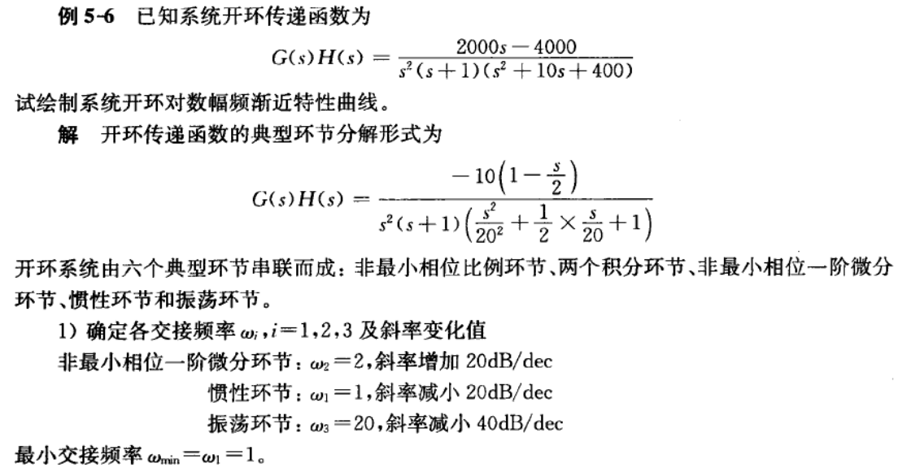
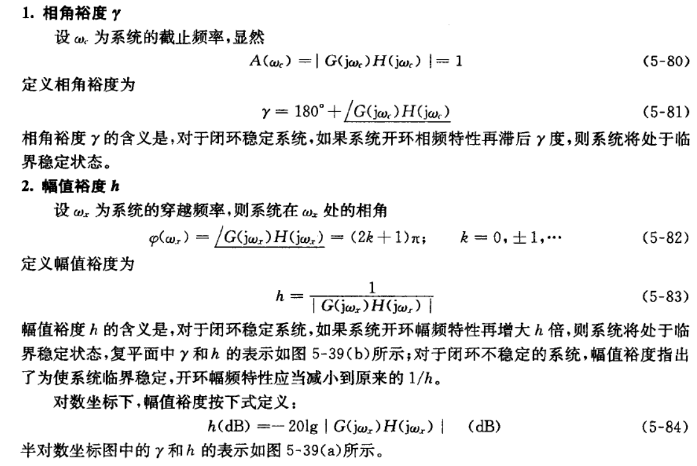
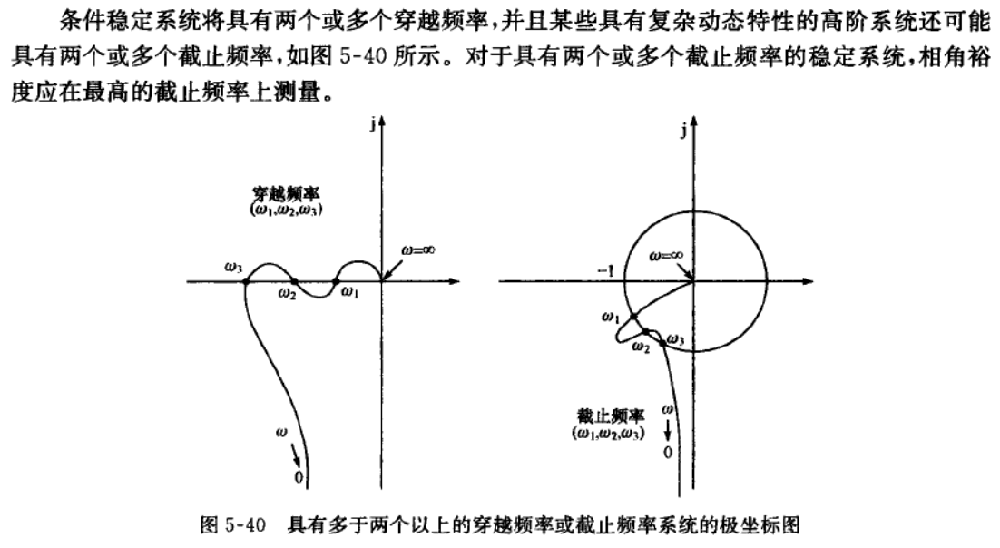
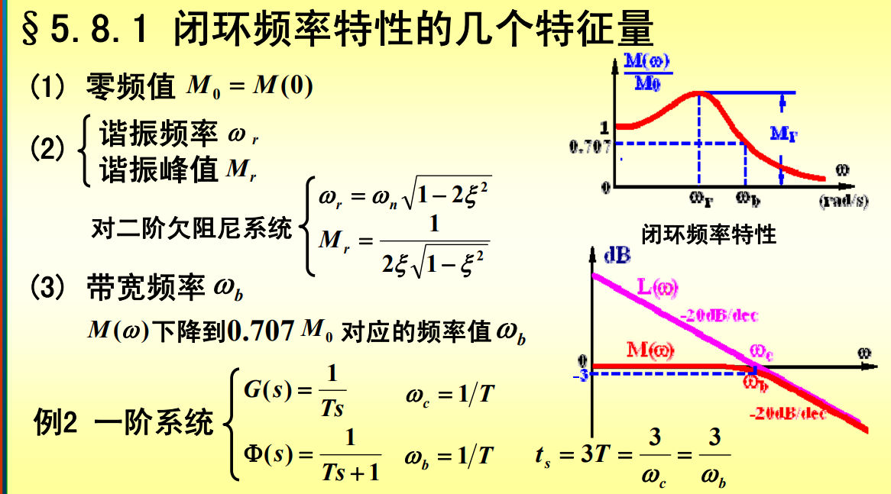

# 线性系统的时域分析方法
## 1. 系统时间响应的性能指标
1. 动态性能
    
2. 稳态性能
    稳态误差是描述系统稳态性能的一种性能指标，通常在阶跃函数、斜坡函数或加速度函数作用下进行测定或计算。若时间趋于无穷时，系统的输出量不等于输入量或输人量的确定函数，则系统存在稳态误差。稳态误差是系统控制精度或抗扰动能力的一种度量。

## 2. 二阶系统时域分析
1. 二阶系统标准形式
    $F(s)=\frac{C(s)}{R(s)}=\frac{\omega_n^2}{s^2+2\zeta\omega_n              s+\omega_n^2}$ 
    自然频率(无阻尼振荡系数)  $\omega_n$
    阻尼比(相对阻尼系数)$\zeta$
    二阶系统特征方程$s^2+2\zeta\omega s+\omega_n^2=0$
    闭环极点$s_{1,2}=-\zeta \omega_n \pm \omega_n \sqrt{\zeta^2-1}$

## 3. 稳定性分析
1. 劳斯稳定判据
   
   例子
   
   

# 线性系统频域分析方法
## 1. 频率特性
RC电路如图所示，$u_i(t)=Asin\omega t$，求$u_o$?
   
   $G(s)=\frac{U_o(s)}{U_i(s)}=\frac{1}{Ts+1}=\frac{\frac{1}{T}}{s+\frac{1}{T}}$，其中$T=RC$
   $U_o(s)=\frac{\frac{1}{T}}{s+\frac{1}{T}}\frac{A\omega}{s^2+\omega^2}=\frac{c_0}{s+\frac{1}{T}}+\frac{c_1s+c_2}{s^2+\omega^2}$
   利用留数法求拉普拉斯反变换
    $c_0=\lim_{s\rightarrow-1/T}\frac{A\omega/T}{s^2+\omega^2}=\frac{A\omega T}{1+\omega^2T^2}$
    $c_1=\frac{-A\omega T}{1+\omega^2T^2}$
    $c_2=\frac{A\omega}{1+\omega^2T^2}$
   $U_o(s)=\frac{A\omega T}{1+\omega^2T^2}\frac{1}{s+\frac{1}{T}}+\frac{A}{\sqrt{1+\omega^2T^2}}[\frac{1}{\sqrt{1+\omega^2T^2}}\frac{\omega}{s^2+\omega^2}-\frac{T\omega}{\sqrt{1+\omega^2T^2}}\frac{s}{s^2+\omega^2}]$
   
   $u_o(t)=\frac{A\omega T}{1+\omega^2T^2}e^{-t/T}+\frac{A}{\sqrt{1+\omega^2T^2}}[sin\omega t \cdot cos\alpha - cos\omega t\cdot sin\alpha]$
   $=\frac{A\omega T}{1+\omega^2T^2}e^{-t/T}+\frac{A}{\sqrt{1+\omega^2T^2}}sin(\omega t-arctan\omega T)$
   上式中，稳态分量为
   $u_{o_s}(t)=\frac{A}{\sqrt{1+\omega^2T^2}}sin(\omega t-arctan\omega T)=A\cdot A(\omega)sin[\omega t + \varphi (\omega)]$
   式中，$A(\omega)=\frac{1}{\sqrt{1+\omega^2T^2}},\varphi (\omega)=-arctan \omega T$，分别反映RC网络在正弦信号作用下，输出稳态分量的幅值和相位的变化，称为幅值比和相位差，且皆为输入正弦信号频率$\omega$的函数。
   
   **频率特性定义**
   + $G(j\omega)$定义一：$G(j\omega)=|G(j\omega)|\angle G(j\omega)$（频率特性的物理意义）
    $$
    \begin{cases}
    |G(j\omega)|= \frac{|u_o(t)|}{|u_i(t)|}=\frac{1}{\sqrt{1+\omega^2T^2}}\\
    \angle G(j\omega)=\angle u_o(t) - \angle u_i(t) = -arctan\omega T
    \end{cases}
    $$
    $|G(j\omega)|$幅值比
    $\angle G(j\omega)$相角差

   + $G(j\omega)$定义二：$G(j\omega)=G(s)|_{s=j\omega}$（怎么找系统频率特性）
    $\frac{1}{\sqrt{1+\omega^2T^2}}\angle -arctan\omega T=|\frac{1}{1+j\omega T}|\angle \frac{1}{1+j\omega T}=\frac{1}{1+j\omega T}=\frac{1}{Ts+1}|_{s=j\omega}$
   + $G(j\omega)$定义三：$G(j\omega)=\frac{U_o(j\omega)}{U_i(j\omega)}$（从傅氏变换定义频率特性）

   

## 2.典型环节与开环系统频率特性
### 2.1典型环节
最小相位环节有7种
非最小相位环节有5种
开环传递函数的典型环节分解可将开环系统表示为若干个典型环节的串联形式
$G(s)H(s)=\prod_{i=1}^{N}G_i(s)$
设典型环节的频率特性为
$G(j\omega)=A_i(\omega)e^{j\varphi_{i}(\omega)}$
则系统开环频率特性
$G(j\omega)H(j\omega)=[\prod_{i=1}^{N}A_i(\omega)]e^{j[\sum_{i=1}^{N}\varphi_i(\omega)]}$
系统开环幅频特性和开环相频特性
$A(\omega)=\prod_{i=1}^{N}A_i(\omega),\varphi(\omega)=\sum_{i=1}^{N}\varphi_i(\omega)$
系统开环对数幅频特性
$L(\omega)=20lgA(\omega)=\sum_{i=1}^{N}20lgA_i(\omega)=\sum_{i=1}^{N}L_i(\omega)$
### 2.2典型环节的频率特性

   

### 2.3开环对数频率特性曲线
   

   例题
   
   

## 3.奈奎斯特稳定判据
**Nyquist**:
$Z=P-R=P-2N=P-2(N_+-N_-)$
$Z$闭环传递函数在右半平面极点个数
$P$开环传递函数在右半平面极点个数
$N$幅相曲线包围$(-1,j0)$点圈数

## 4.稳定裕度
   
   
   
   

## 5.利用开环频率特性分析系统的性能
**三频段理论**
   
   

## 6.利用闭环频率特性分析系统的性能
   

# 线性离散系统的分析与校正
## 1.z变换与反变换
### 1.1 z变换定义
$E(z)=Z[e^*(t)]=E^*(s)|_{z=e^{Ts}}=\sum_{n=0}^{\infty}e(nT)\cdot z^{-n}$
$E(z)$:像
$e^*(t)$:原像
***注：z变换中$E(z)$只对应唯一的$e^*(t)$,不对应唯一的$e(t)$***

### 1.2 z变换方法
+ 级数求和法（定义法）
+ 查表法（部分分式展开法）
+ 留数法（反演积分法）
   

### 1.3 z反变换方法
+ 幂级数法（长除法）
+ 查表法（部分分式展开法）
  以$\frac{E(z)}{z}的形式展开$
+ 留数法（反演积分法）
   

## 2.稳定性
**稳定的充分必要条件**
$\Phi (z)$的全部极点均位于z平面的单位圆内
**稳定性判据**
+ w域中的劳斯(Routh)稳定判据
   
+ z域中的朱利(Jurry)稳定判据
+ z域中的根轨迹法
  
# 非线性控制系统分析
+ 相平面法
+ 描述函数法